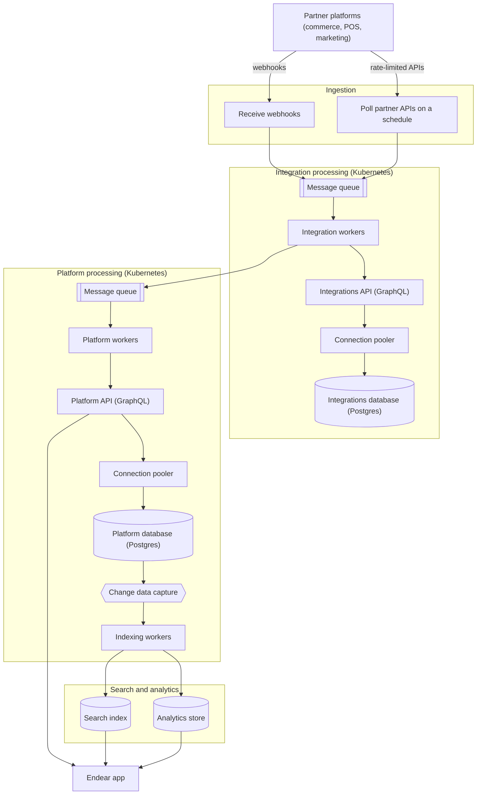

## Problem context

Endear is used by retail brands, and most of its data comes from the commerce, point of sale and marketing platforms those brands use. Black Friday and Cyber Monday (BFCM) is the weekend after US Thanksgiving in late November and the busiest shopping period of the year. Order and customer volumes can reach several times their normal levels, arrive in sharp bursts, and stay high for several days. At the same time, brands rely on Endear most heavily to reach their customers.

You have been asked to get the system ready for the next BFCM, where we expect several times our normal ingestion volume. Using this diagram, how would you prepare, and where would you start?

[Architecture diagram in Figma](https://www.figma.com/board/piL3qE3Yf7B0wZNWZuVsIq/Integrations-data-pipeline?node-id=0-1&p=f&t=EsDqMOzvxDyh3yVI-0)

